# MotoLens Garage

MotoLens Garage is a single-file Kivy/KivyMD motorcycle maintenance companion.
It turns a simple garage app into a guided inspection system, service-manual
reader, mileage tracker, and AI-assisted mechanic chat surface. The current
prototype lives in `main.py`, while `buildozer.spec`, `requirements.txt`, and
`.github/workflows/qrs-deploy.yml` describe the Android release path.

The app is built around one practical idea: a rider should be able to add a
motorcycle, document its baseline condition, attach model-specific maintenance
evidence, track ride mileage, and ask informed repair questions without losing
the safety boundary that real motorcycles require. MotoLens can help organize
evidence and produce structured guidance, but it does not replace the official
owner's manual, the official service manual, calibrated measuring tools, or a
qualified mechanic.

## Product Goals

MotoLens is designed to feel like a premium garage cockpit instead of a generic
form app. The interface uses dark surfaces, high-contrast teal accents, compact
navigation, large readable cards, guided prompts, and long-form AI responses
that remain grounded in retrieved manual pages. The product flow favors a
baseline inspection first, then ongoing service tracking as the motorcycle
accumulates mileage.

The application currently supports:

- A private garage for one or more motorcycles.
- First-launch onboarding for year, make, model, trim, mileage, nickname, and
  rider notes.
- Guided inspection items for chain, tires, brakes, fluids, controls, lights,
  suspension, wheels, and critical fasteners.
- Photo prompts for chain, tire tread, brake pads, rotors, fluid leaks, and
  other visual evidence.
- Vehicle health reports with a bounded scoring model.
- Service interval research with OpenAI web search when the user has configured
  a key.
- A service manual finder, PDF downloader, indexer, and zoomable reader.
- A local retrieval layer for the AI Mechanic chat agent.
- GPS mileage tracking for personal rides, DoorDash, Uber Eats, or other
  delivery work.
- Encrypted storage for sensitive notes, routes, and user-supplied API keys.
- Android Buildozer packaging and GitHub Actions release automation.

## Screen Guide

The Garage screen is the home base. It shows the active motorcycle, current
mileage, vehicle state, health score, and baseline inspection progress. The
garage card is intentionally sparse because it needs to work as a launchpad,
not a noisy dashboard. A rider should be able to open the app, understand
whether the bike is ready, and jump to the next action without searching.

The Inspection screen is a guided checklist. Each item includes a category,
plain-language instructions, photo requirements when needed, and status
controls. `PASS` means no issue was observed during that step. `MONITOR` means
the rider should keep watching it or recheck soon. `SERVICE` means the bike has
a concern that should be handled before normal use. `SKIP` keeps the inspection
moving but lowers confidence because evidence is missing.

The Service screen collects scheduled and researched maintenance work. Local
seed tasks create a conservative starter plan, while researched tasks can add
source-linked model intervals. The app deliberately keeps researched intervals
separate from local seed tasks so users can tell what came from built-in logic
and what came from manual or web evidence.

The Manual screen is the document workspace. It can search for an authorized
manual, accept a direct PDF link, index pages, render page images, search the
local cache, and open a larger reader. The reader is designed around large
service PDFs that may contain hundreds of pages. Only the pages the rider needs
are rendered and cached.

The AI Mechanic screen is a conversation surface. It retrieves relevant manual
chunks, keeps recent chat context, and asks for a conservative answer. It is
best used for questions such as "what should I inspect after reinstalling rear
wheel spacers?" or "what manual pages matter for brake pad inspection?" It is
not meant for blind approval of unsafe work.

The Ride screen records mileage for normal rides and delivery work. A trip has
a purpose, start time, end time, route points, and distance. Routes are
encrypted at rest. The design goal is an auditable mileage ledger that can
support maintenance reminders and personal delivery-mileage tracking.

The Settings screen owns user-controlled configuration. The OpenAI key is not
compiled into the app. The user adds it after installation, protects it with a
passphrase, and unlocks it for the current session when AI features are needed.

## Screenshots

The images below show the AI Mechanic interface using cached manual excerpts,
manual page citations, repair-risk language, and checklist-style follow-up.
Select any screenshot to open the full-size capture.

<table>
  <tr>
    <td><a href="screenshot1.png">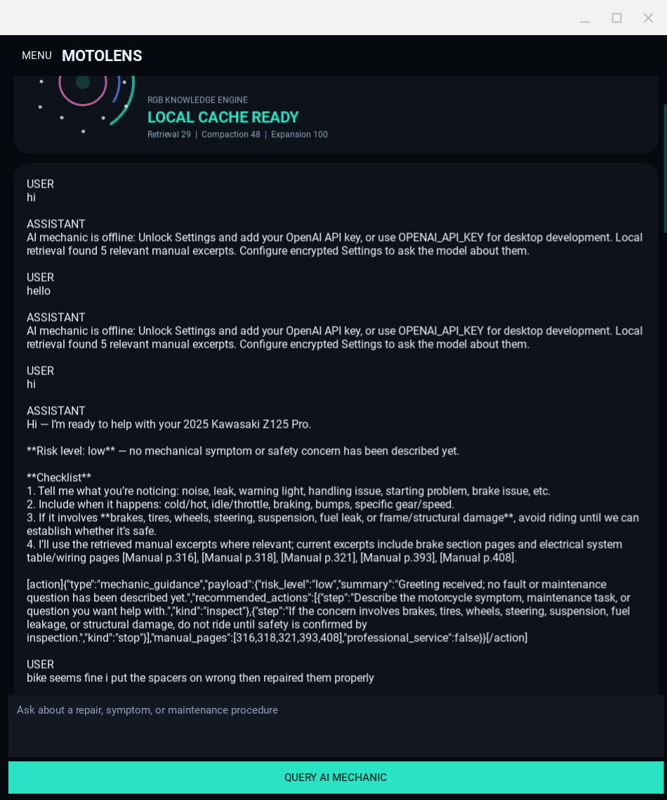</a></td>
    <td><a href="screenshot2.png">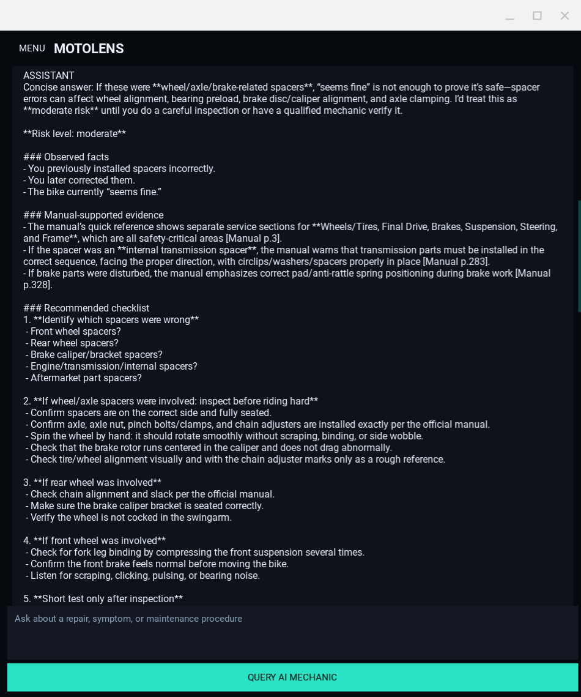</a></td>
    <td><a href="screenshot3.png">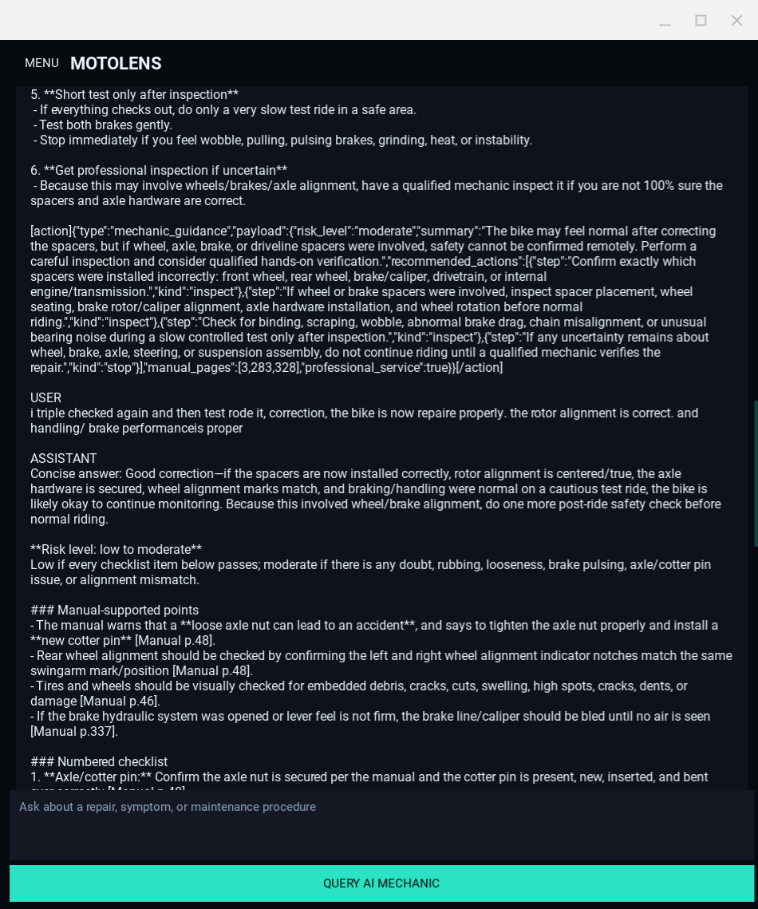</a></td>
  </tr>
  <tr>
    <td><a href="screenshot4.png">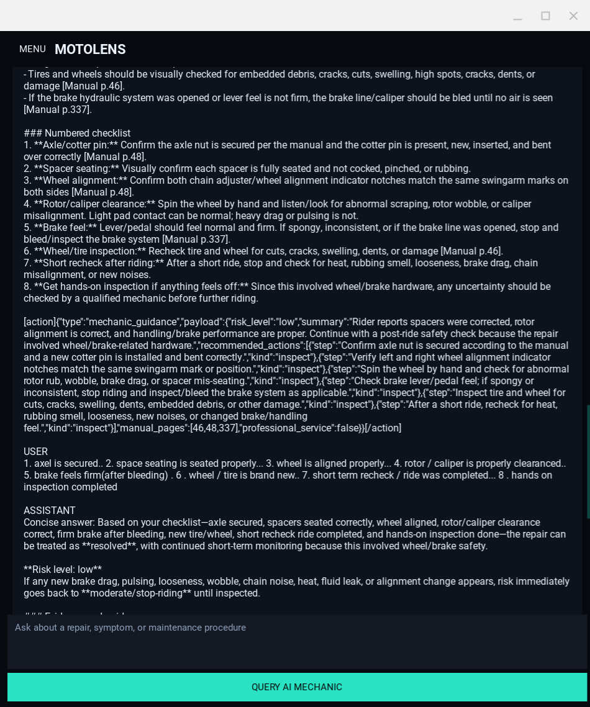</a></td>
    <td><a href="screenshot5.png">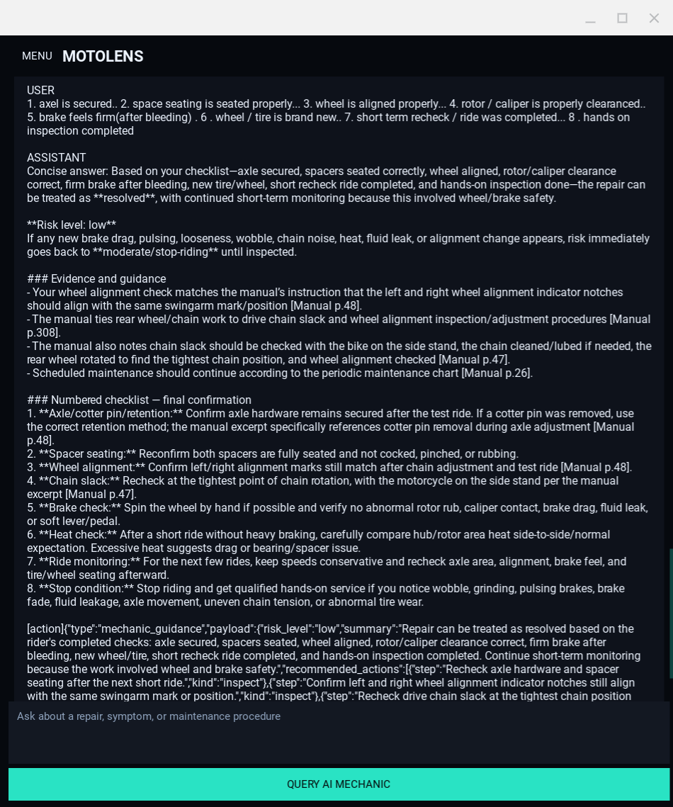</a></td>
    <td><a href="screenshot6.png">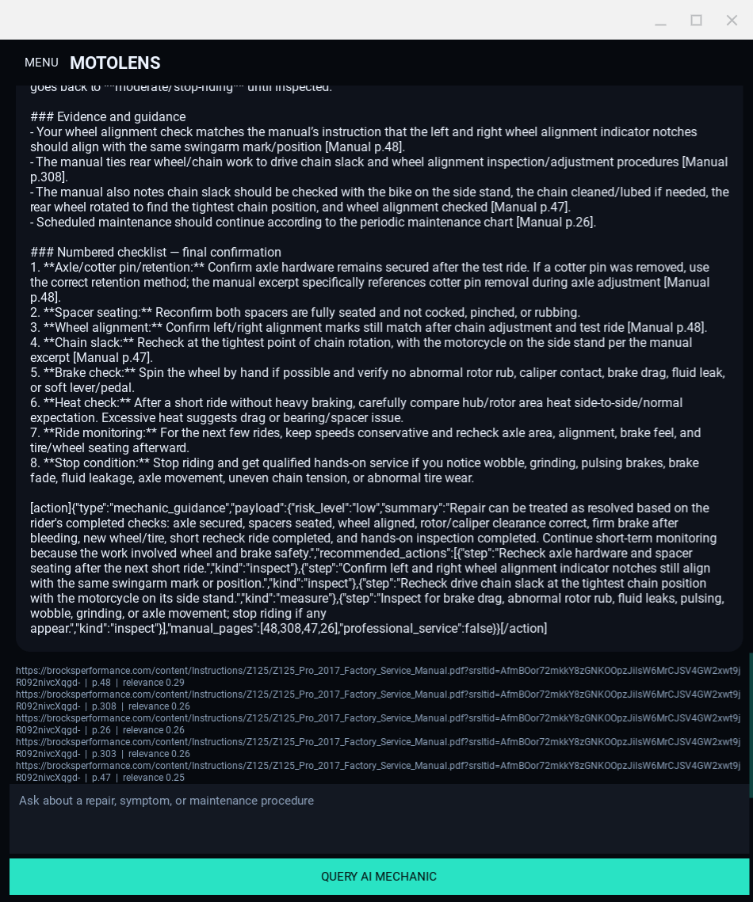</a></td>
  </tr>
</table>

## High-Level Architecture

MotoLens is intentionally compact. Most of the prototype is contained in
`main.py`, with clearly separated service classes for storage, encryption,
manual handling, OpenAI calls, camera hooks, notification hooks, and GPS ride
tracking. The GUI layer sits above those services and calls them through
application methods.

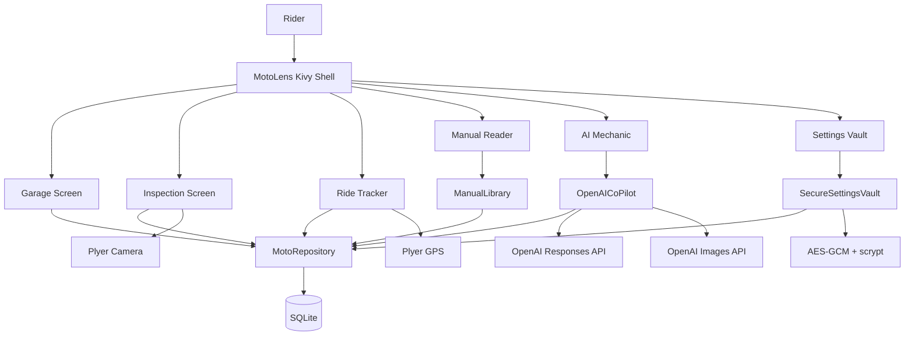

The repository layer owns the durable state. It creates the schema, writes
garage data, encrypts sensitive fields, tracks inspections, stores manual
chunks, saves chat messages, records trips, and keeps rolling database backups.
The app does not build SQL by concatenating user input. Dynamic values use
parameterized SQLite queries, and text entering storage or prompt surfaces is
normalized by the sanitizer.

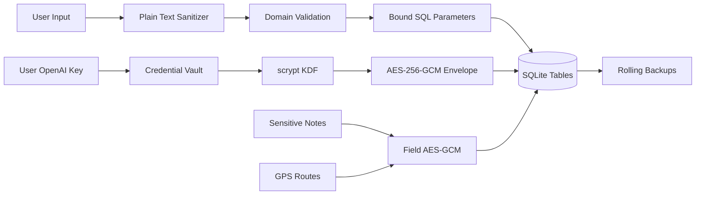

## User Flow

The app starts at the garage. On first launch, MotoLens shows a short setup
dialog and asks for the rider's motorcycle details. Once the motorcycle is
created, the garage card shows the current vehicle, mileage, inspection state,
and health score if a report exists. Adding a motorcycle does not force the
rider into the inspection every launch. Launch inspection reminders are opt-in
from Settings.

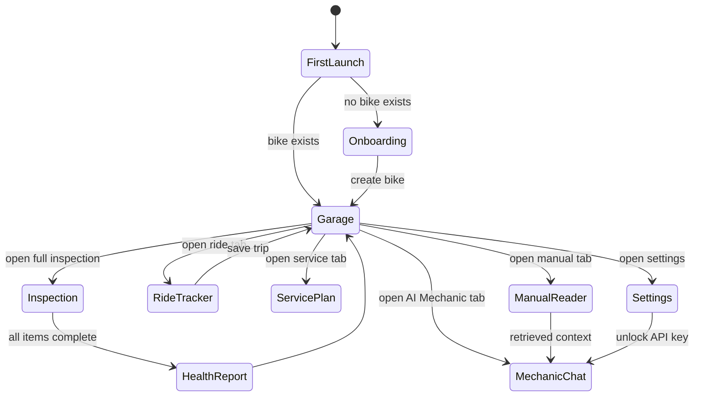

The inspection flow is intentionally conservative. It asks the rider to document
areas that normally appear in a hands-on motorcycle safety inspection:
fasteners, chain, sprockets, front tire, rear tire, brake pads, rotors, fluids,
controls, lighting, suspension, and wheels. Some items require a guided photo.
For example, tire tread can be photographed with a penny used only as a visual
reference, and brake pads can be photographed through the caliper inspection
opening. The app warns that these photos are evidence, not measurements.

## Inspection Health Model

The health report is a structured summary of completed inspection items. It is
not a legal certification and it is not a pass to ride. It is a prioritization
surface. Items can be marked `PASS`, `MONITOR`, `SERVICE`, or `SKIP`. The local
score is bounded so that skipped evidence, monitor flags, service flags, and
missing required photos reduce the displayed score.

The current score model is:

```text
H = clamp(100 - 18S - 7M - 5K - 3G, 0, 100)
```

Where:

- `H` is the vehicle health score.
- `S` is the number of inspection items marked `SERVICE`.
- `M` is the number of inspection items marked `MONITOR`.
- `K` is the number of skipped items.
- `G` is the number of required photo gaps.

The health score intentionally penalizes safety-critical uncertainty. A
motorcycle with an unresolved brake, tire, steering, chain, axle, or fastener
issue should be treated as unsafe until the issue is inspected directly. The
app can help produce the checklist, but it cannot feel a loose bearing, measure
rotor thickness, verify torque, or inspect hidden damage.

## Service Manual System

The Manual tab can accept a direct public HTTPS PDF or ask the AI system to
search for an authorized manual candidate. The downloader rejects local hosts,
embedded URL credentials, non-HTTPS links, non-PDF URLs, unsafe redirects,
manuals above 80 MB, and manuals above 800 pages. This keeps the downloader
bounded and avoids quietly indexing arbitrary unsafe sources.

Once a PDF is accepted, MotoLens stores it in the app's private manual
directory, computes a SHA-256 hash, extracts searchable text when available,
and creates overlapping chunks. Desktop development uses `PyMuPDF` for text
extraction and page rendering. Packaged Android builds use the Android platform
PDF renderer for page images and fall back to online evidence where local text
extraction is unavailable.

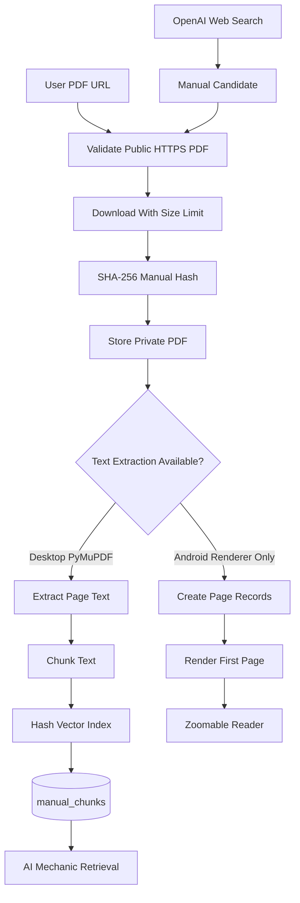

The reader renders pages lazily. That matters for large manuals. A 508 page PDF
should not render every page when the rider only needs page 48. MotoLens
renders the visible page, saves it as a JPEG, and prefetches nearby pages in the
background. The user can zoom, reset zoom, open a focus reader, search the
manual cache, and toggle a text preview.

## Service Manual Chat Agent

The AI Mechanic tab is a retrieval-augmented chat workflow. It does not simply
send the user's question to a model. It first retrieves local manual chunks,
collects recent chat history, builds a compact evidence packet, and asks the
model for a safety-first answer. Responses are expected to include visible
citations and a structured `[action]...[/action]` block that the app can parse
for risk, summary, recommended actions, relevant pages, and professional
service flags.

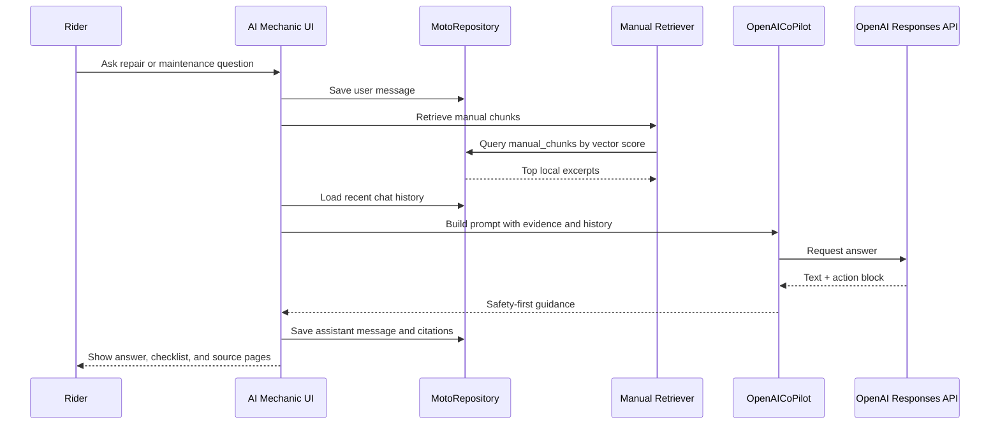

### Chunking Equation

Manual text is split into overlapping chunks so retrieval can find a small
service procedure without needing to send the full PDF to the model.

```text
C_i = T[p_i : p_i + L]
p_{i+1} = p_i + L - O
```

Where:

- `T` is the manual page text stream.
- `C_i` is chunk `i`.
- `L` is the target chunk length.
- `O` is the overlap.
- `p_i` is the starting offset.

In this prototype, `L` is 1800 characters and `O` is 260 characters. The
overlap keeps procedure steps from being split too sharply across chunks.

### Hashed Vector Equation

MotoLens uses a lightweight local vector style instead of a heavy external
vector database. Tokens are hashed into a fixed number of dimensions. Each
token contributes a signed count to one bucket, and the final vector is
normalized.

```text
v_j(c) = sum_{t in tokens(c)} s(t) * I[h(t) mod d = j]
V(c) = v(c) / ||v(c)||_2
```

Where:

- `c` is a chunk.
- `t` is a token.
- `h(t)` is a stable hash.
- `s(t)` is a deterministic sign derived from the hash.
- `d` is the vector dimension count.
- `I[...]` is 1 when the condition is true and 0 otherwise.

This is not a replacement for a production embedding model. It is a fast local
retrieval surface that works without network access and keeps manual evidence
available on device.

### Retrieval Score

For a user query `q` and manual chunk `c`, the local retrieval score is cosine
similarity:

```text
score(q, c) = V(q) dot V(c)
```

The app selects the top `k` chunks:

```text
K_q = top_k({c_1, c_2, ..., c_n}, score(q, c_i))
```

Those chunks become the local manual evidence packet for the AI Mechanic
prompt. The visible UI gauges describe retrieval, compaction, and expansion
pressure. They are telemetry for the knowledge surface, not claims of quantum
computation or cryptographic strength.

### Prompt Assembly

The AI Mechanic prompt is assembled from a few bounded inputs:

```text
P = system_rules + vehicle_profile + user_question + recent_history + K_q
```

The rules tell the model to avoid inventing torque values, wear limits, service
intervals, and model fitment. The model is asked to identify uncertainty, keep
manual excerpts as evidence rather than blind instructions, and recommend
professional service when safety-critical systems are involved.

### Action Block Contract

The structured block is wrapped in tags so the UI can extract it from a normal
human-readable response.

```text
[action]
{
  "type": "mechanic_guidance",
  "payload": {
    "risk_level": "low | moderate | high",
    "summary": "short status summary",
    "recommended_actions": [
      {"step": "inspect brake feel", "kind": "inspect"}
    ],
    "manual_pages": [48, 308],
    "professional_service": false
  }
}
[/action]
```

The action block is not hidden from the user in the current prototype. That is
intentional during development because it makes model behavior auditable. A
future production UI could parse it into a cleaner card and keep the raw block
behind a diagnostics toggle.

## Service Interval Research

MotoLens can research service intervals per vehicle when the user has unlocked
Settings with an OpenAI API key. The app first tries to use local manual
evidence. If the manual cache is missing or incomplete, the prompt enables
OpenAI web search and asks for official or clearly authorized sources. Every
stored researched interval must include a source URL.

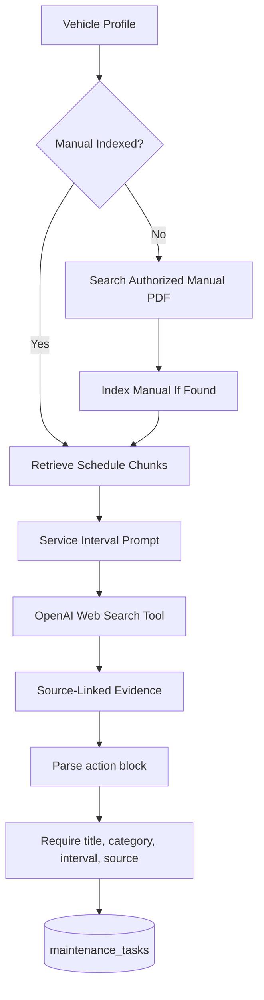

The interval due model is straightforward:

```text
due_mileage = current_mileage + interval_miles
due_date = today + interval_months
```

If a source supports only mileage, months are set to 0. If a source supports
only time, mileage is set to 0. If no source supports a value, MotoLens does
not invent it.

## Ride Mileage Tracking

The Ride tab tracks route points through Plyer GPS when available. A trip is
started with a purpose such as Personal, DoorDash, or Uber Eats. Each GPS point
is appended to the active route, and distance is estimated with the haversine
formula.

```text
a = sin^2(delta_phi / 2) + cos(phi_1) cos(phi_2) sin^2(delta_lambda / 2)
d = 2r atan2(sqrt(a), sqrt(1 - a))
```

Where:

- `phi` is latitude in radians.
- `lambda` is longitude in radians.
- `r` is Earth radius in miles.
- `d` is segment distance.

When the trip stops, MotoLens writes the encrypted route, distance, purpose,
start time, end time, and trip state. The bike mileage is incremented by the
rounded trip distance. The ride ledger remains auditable because trips are
stored as durable records, not just rolled into a single mileage number.

## Encryption and Storage

MotoLens uses SQLite for app state. Sensitive text fields use an encrypted
envelope when `cryptography` is installed. Credential storage is stricter:
user-supplied OpenAI keys are encrypted with AES-256-GCM and a scrypt-derived
key. The user passphrase is never stored. The unlocked key remains in memory
for the active session.

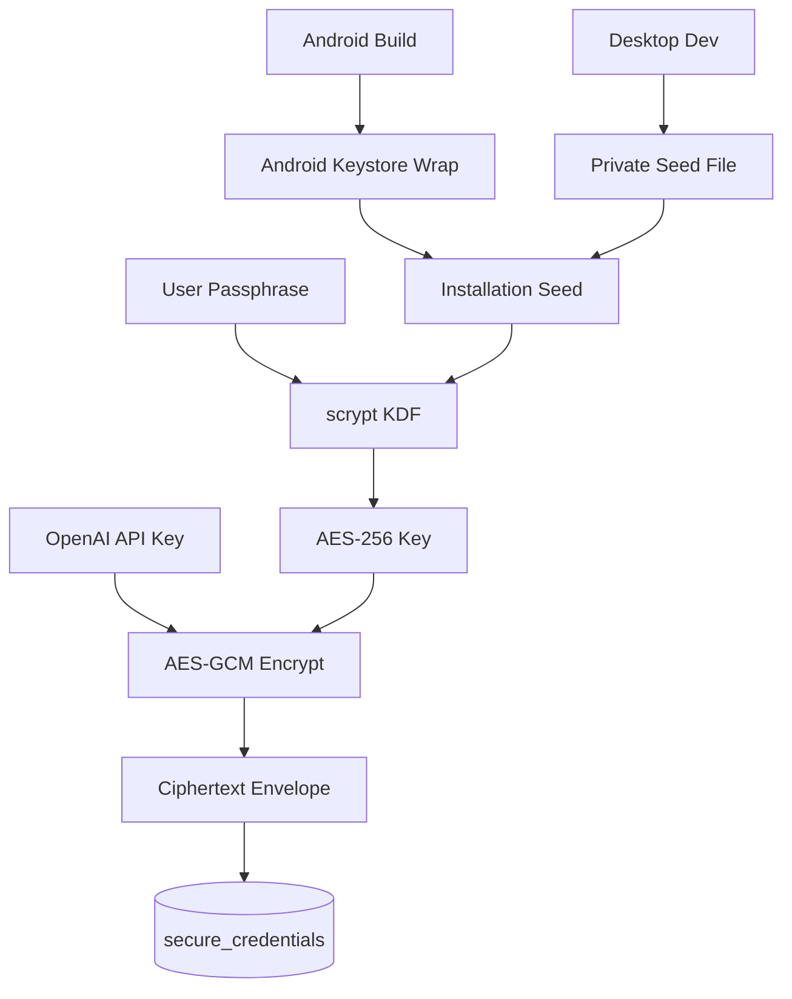

The Android path tries to wrap the installation seed with Android Keystore. If
that layer cannot initialize, MotoLens does not silently downgrade credential
protection. Desktop development uses a private local seed file because it does
not have Android Keystore.

This is still not the same as full database-at-rest encryption. A production
app should consider SQLCipher or a platform storage encryption layer for the
whole database. Local encrypted storage reduces casual disclosure risk, but it
does not make secrets impossible to extract from a compromised phone.

## OpenAI Integration

OpenAI is optional. The app can run offline for garage storage, local
inspection checklists, manual viewing, and mileage tracking. Cloud AI features
activate when the user unlocks Settings with a key or when desktop development
sets `OPENAI_API_KEY`.

The prototype uses:

- `gpt-5.5` for service interval research, manual search, inspection-photo
  review, and AI Mechanic text reasoning.
- `gpt-image-2` for generated motorcycle portraits and report artwork.
- The Responses API with the built-in `web_search` tool for source discovery.
- A small standard-library REST adapter in Android builds so the APK does not
  need to package the desktop OpenAI SDK and its compiled transitive
  dependencies.

The app prompts the model to be conservative. It should not invent torque
values, fluid grades, service limits, or service intervals. It should mark
uncertainty, explain when a photo cannot replace a measurement, and recommend
professional hands-on inspection when brakes, tires, steering, wheels,
suspension, fuel leaks, or structural damage are involved.

## Android Runtime Notes

The Android build uses app-private storage rather than a desktop `~/.local`
directory. If a launch failure occurs, MotoLens prints a traceback to logcat
and also tries to write `motolens-crash.log` inside private app storage. For a
USB-connected device:

```bash
adb logcat -s python:D Python:D ActivityManager:I
```

The Buildozer dependency list is intentionally smaller than the desktop
requirements. Some desktop packages, such as `PyMuPDF`, `nh3`, and `psutil`,
have native components and are not safe to add blindly to Android packaging
without python-for-android recipes. The app handles those capabilities with
fallbacks where possible. Desktop CI can still install the full
`requirements.txt` and exercise the richer local test path.

## Local Desktop Build

These steps are for Linux development. They assume Python 3.11 is available.

```bash
cd /home/user/moto-lens
python3 -m venv .venv
source .venv/bin/activate
python -m pip install --upgrade pip wheel setuptools
python -m pip install -r requirements.txt
python main.py --test
python main.py
```

If Kivy opens a window but file logging fails in a restricted environment, set a
temporary home directory:

```bash
mkdir -p /tmp/motolens-home
HOME=/tmp/motolens-home python main.py
```

To run tests through the helper:

```bash
bash run_tests.sh
```

The headless suite verifies repository behavior, encryption round trips where
dependencies are installed, inspection scoring, ride tracking, manual chunk
retrieval, sanitizer behavior, OpenAI action-block parsing, and Android
private-storage path selection.

## Local Troubleshooting

If the GUI does not start, first confirm that the correct virtual environment
is active and that Kivy imports from that environment:

```bash
python -c "import kivy, kivymd; print(kivy.__version__); print(kivymd.__version__)"
```

If `python main.py --test` passes but the GUI fails, the issue is probably a
Kivy window, graphics, or local dependency problem rather than a repository
schema problem. Check the terminal output for Kivy provider messages, missing
SDL libraries, or a read-only home directory. A restricted shell may block Kivy
from writing its normal log file under `~/.kivy`; using a temporary `HOME`
usually avoids that during development.

If AI features show as offline, unlock Settings with the passphrase used when
the key was saved. Desktop developers can also set:

```bash
export OPENAI_API_KEY="sk-..."
python main.py
```

If manual search works but local PDF rendering fails on desktop, confirm that
`PyMuPDF` is installed in the active environment:

```bash
python -c "import fitz; print(fitz.__doc__[:80])"
```

If Android launches to the splash screen and then exits, use logcat and look for
`MotoLens boot failure`. The app also attempts to write `motolens-crash.log`
inside private app storage. The most likely causes are missing Android recipes,
incorrect storage paths, SDK mismatches, or a packaged dependency that imports
correctly on desktop but not inside python-for-android.

## Android Build With Buildozer

The checked-in `buildozer.spec` targets API 35 and builds an arm64-v8a Android
app. It intentionally keeps the existing Play application ID:
`com.qroadscan.lightcal`. That lets the current internal-testing listing accept
updates even though the visible app title is now MotoLens.

Install Buildozer and Android prerequisites in a Linux environment, then run:

```bash
cd /home/user/moto-lens
python3 -m venv .venv
source .venv/bin/activate
python -m pip install --upgrade pip wheel setuptools
python -m pip install "Cython<3.0" buildozer
buildozer -v android debug
```

For a signed release AAB, the workflow uses these environment variables:

```bash
P4A_RELEASE_KEYSTORE=/path/to/qrs-upload.jks
P4A_RELEASE_KEYSTORE_PASSWD=...
P4A_RELEASE_KEYALIAS=...
P4A_RELEASE_KEYALIAS_PASSWD=...
buildozer -v android release
```

The generated APK or AAB appears in `bin/`.

## GitHub Actions Pipeline

The workflow in `.github/workflows/qrs-deploy.yml` runs on pushes, pull
requests, and manual dispatch. It installs Python, desktop smoke dependencies,
Android SDK API 35 packages, Buildozer, and python-for-android build tools.

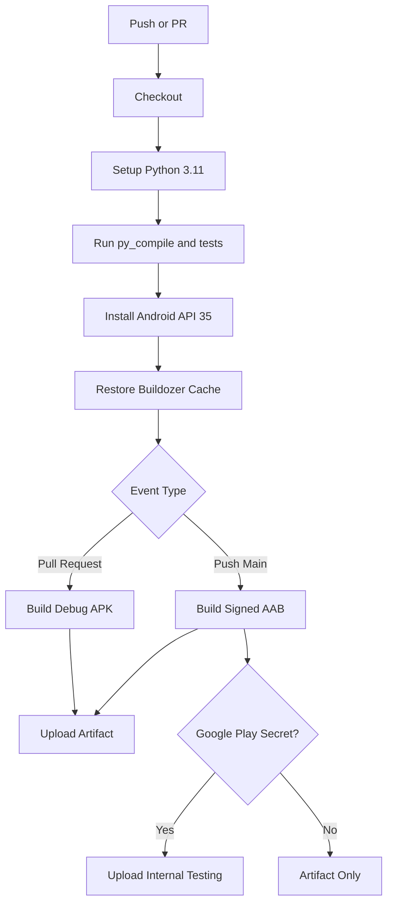

Secrets used by the release path:

- `ANDROID_KEYSTORE_B64`
- `ANDROID_KEYSTORE_PASSWORD`
- `ANDROID_KEY_ALIAS`
- `ANDROID_KEY_PASSWORD`
- `GOOGLE_PLAY_SERVICE_ACCOUNT_JSON`, optional for internal-track upload

If `GOOGLE_PLAY_SERVICE_ACCOUNT_JSON` is missing, the workflow still builds and
uploads the AAB artifact. It just skips the Play upload step.

## Android Dependency Strategy

The Android requirement list is not supposed to match `requirements.txt`
exactly. Desktop development can use normal wheels for `PyMuPDF`, `nh3`,
`psutil`, and the OpenAI SDK. Android packaging is stricter because
python-for-android needs recipes for native extensions. Adding every desktop
package to `buildozer.spec` may make the build fail before the app even reaches
the phone.

MotoLens handles this by splitting capabilities:

- Kivy, KivyMD, `cryptography`, and Plyer are packaged for Android.
- PDF page rendering uses Android's platform renderer when `PyMuPDF` is not
  available.
- Sanitization uses `nh3` on desktop and a conservative fallback elsewhere.
- Device entropy context uses `psutil` on desktop and falls back safely when it
  is unavailable.
- OpenAI calls use the SDK where available and a small REST adapter where the
  SDK is not packaged.

That split keeps the Android app buildable while preserving richer development
checks on the desktop. If future work adds python-for-android recipes for the
native packages, the Android dependency set can be expanded carefully and
tested through CI before shipping.

## File Map

```text
main.py                         Single-file application and tests
requirements.txt                Desktop development and CI smoke dependencies
buildozer.spec                  Android package configuration
run_tests.sh                    Headless test helper
privacy-policy.md               Play-facing privacy policy draft
.github/workflows/qrs-deploy.yml Android CI/CD workflow
screenshot1.png ... screenshot6.png README gallery images
```

Inside `main.py`, the main service classes are:

- `MotoRepository`: SQLite schema, transactions, garage, inspection, reports,
  manuals, maintenance tasks, rides, chat history, and backups.
- `SecureSettingsVault`: user API key encryption with AES-GCM and scrypt.
- `ManualLibrary`: PDF validation, download, indexing, chunking, and rendering.
- `AndroidPdfRenderer`: Android platform PDF rendering fallback.
- `OpenAICoPilot`: AI research, manual discovery, image generation, photo
  inspection, and mechanic chat calls.
- `DirectOpenAIClient`: small REST fallback for Android OpenAI calls.
- `RideTracker`: GPS point capture and trip completion.
- `MotoLensApp`: Kivy application shell and screen orchestration.

## Safety Rules

MotoLens should always behave like a careful assistant, not a fake expert. The
following rules are part of the product philosophy:

- Do not invent torque values.
- Do not invent wear limits.
- Do not invent service intervals.
- Do not treat photos as measurements.
- Do not tell a rider that safety-critical work is safe when the evidence is
  incomplete.
- Do recommend the official manual, calibrated tools, and qualified mechanics
  for brakes, tires, steering, suspension, wheels, axle hardware, fuel leaks,
  and structural concerns.

That boundary is especially important because the app can sound confident.
Motorcycles are physical systems. Software can organize evidence, but it cannot
touch the motorcycle.

## Current Limitations

The project is still a prototype. Important future work includes:

- A native mobile layout pass for every screen size.
- Better Android runtime logging collection after internal-testing installs.
- A production-ready database encryption layer such as SQLCipher.
- More robust PDF text extraction on Android.
- Clearer rendering of AI action blocks into cards instead of raw text.
- More test coverage around manual discovery and failed network states.
- A backend option for users who do not want API keys stored on device.
- A full permission declaration and review pass before wider Play rollout.

## Development Notes

The repository currently has a local commit for the screenshot gallery. If you
use HTTPS remotes without a GitHub credential helper, `git push` will fail with
an authentication error. Configure GitHub credentials, SSH, or GitHub CLI before
pushing:

```bash
git status --short --branch
git log --oneline --decorate -3
git push origin main
```

The previous Android repair stash remains available unless it has been dropped:

```bash
git stash list
```

## Legal and Maintenance Notice

Motorcycle service specifications vary by model, year, market, trim, and
modification history. MotoLens intentionally avoids pretending that one generic
specification can apply everywhere. Use the official owner's manual, the
official service manual, manufacturer service bulletins, calibrated measuring
tools, and a qualified mechanic for safety-critical decisions.

Only download manuals that the manufacturer or another authorized source makes
publicly available. Respect copyright and licensing terms. The manual downloader
is built to reject obviously unsafe URLs, not to decide legal ownership.
